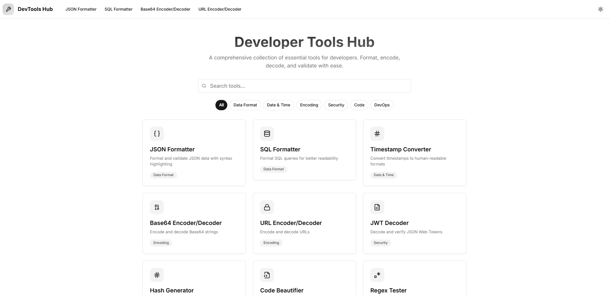

# DevTools Hub

A collection of essential developer tools built with Next.js 13 and Tailwind CSS. This project provides a modern, responsive interface for common development tasks.



[Online Site](https://tool.hackfun.net)

## 🚀 Features

### Development Tools

- **Base64 Tool**
  - Encode/Decode Base64 strings
  - Support for file encoding
  - Real-time conversion

- **JSON Formatter**
  - Format and validate JSON
  - Collapsible tree view
  - Syntax error detection
  - Line and column error indicators

- **JWT Decoder**
  - Decode JWT tokens
  - Validate signatures
  - Display header and payload
  - Expiration checking

- **SQL Formatter**
  - Format SQL queries
  - Syntax highlighting
  - Support for multiple SQL dialects
  - Query beautification

- **Timestamp Converter**
  - Convert between different time formats
  - Unix timestamp conversion
  - Timezone support
  - Common format presets

- **Hash Generator**
  - Support for MD5, SHA-1, SHA-256, SHA-512
  - Real-time hashing
  - Copy to clipboard
  - Multiple hash formats

- **Regex Tester**
  - Test regular expressions
  - Real-time matching
  - Match highlighting
  - Support for all regex flags

- **Cron Expression Generator**
  - Visual cron expression builder
  - Expression validation
  - Next run time prediction
  - Common patterns

- **Protocol Buffers Formatter**
  - Format proto files
  - Field renumbering
  - Syntax validation
  - Proper indentation

- **Code Beautifier**
  - Support for multiple languages
  - Syntax highlighting
  - Customizable formatting
  - Copy formatted code

### UI/UX Features

- 🌓 Dark/Light mode support
- 📱 Responsive design for all devices
- ⌨️ Keyboard shortcuts
- 🖱️ Custom scrollbars
- 📋 Copy to clipboard functionality
- 🎨 Syntax highlighting
- ⚡ Real-time updates
- 🔍 Error highlighting

## 🛠️ Tech Stack

- [Next.js 13](https://nextjs.org/) - React framework
- [TypeScript](https://www.typescriptlang.org/) - Type safety
- [Tailwind CSS](https://tailwindcss.com/) - Styling
- [shadcn/ui](https://ui.shadcn.com/) - UI components
- [Prism.js](https://prismjs.com/) - Syntax highlighting
- [Lucide Icons](https://lucide.dev/) - Icons

## 🚦 Getting Started

### Prerequisites

- Node.js 16.8 or later
- npm or yarn
- Git

### Installation

1. Clone the repository:
```bash
git clone https://github.com/yourusername/devtools-hub.git
```

2. Navigate to the project directory:
```bash
cd devtools-hub
```

3. Install dependencies:
```bash
npm install
# or
yarn install
```

4. Create a `.env.local` file in the root directory:
```bash
cp .env.example .env.local
```

5. Start the development server:
```bash
npm run dev
# or
yarn dev
```

6. Open [http://localhost:3000](http://localhost:3000) in your browser.

### Build for Production

1. Build the application:
```bash
npm run build
# or
yarn build
```

2. Start the production server:
```bash
npm run start
# or
yarn start
```

### Docker Deployment

1. Build the Docker image:
```bash
docker build -t devtools-hub .
```

2. Run the container:
```bash
docker run -p 3000:3000 devtools-hub
```

## 🔧 Development

### Project Structure

```
devtools-hub/
├── app/
│   ├── components/     # Reusable UI components
│   ├── tools/         # Individual tool pages
│   ├── layout.tsx     # Root layout
│   └── page.tsx       # Home page
├── public/            # Static assets
├── styles/           # Global styles
└── types/            # TypeScript type definitions
```

### Adding a New Tool

1. Create a new directory in `app/tools/`:
```bash
mkdir app/tools/your-tool-name
```

2. Create the tool component:
```tsx
// app/tools/your-tool-name/page.tsx
"use client"

export default function YourTool() {
    return (
        // Your tool implementation
    )
}
```

3. Add the tool to the navigation menu.

### Code Style

- Follow the TypeScript + React best practices
- Use ES6+ features
- Follow the existing component patterns
- Write meaningful comments
- Use proper TypeScript types

### Testing

Run the test suite:
```bash
npm run test
# or
yarn test
```

## 📦 Deployment

### Vercel (Recommended)

1. Push your code to GitHub
2. Import your repository in Vercel
3. Configure your deployment settings
4. Deploy

### Manual Deployment

1. Build the application:
```bash
npm run build
```

2. Deploy the `/.next` directory to your hosting provider

## 🤝 Contributing
