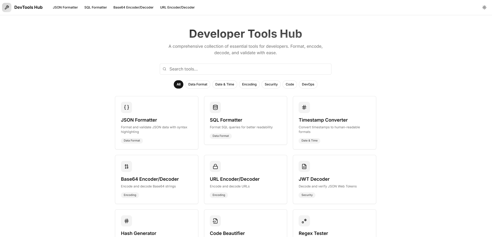

[English Version](./README.md)

# DevTools Hub 开发者工具集

一个基于 Next.js 13 和 Tailwind CSS 构建的开发者常用工具集合。本项目为常见开发任务提供了现代化、响应式的界面。



[在线体验](https://dev.orz.ai)

## 🚀 功能特性

### 开发工具

- **Base64 工具**
  - Base64 字符串编码/解码
  - 支持文件编码
  - 实时转换

- **JSON 格式化工具**
  - 格式化和校验 JSON
  - 可折叠树形视图
  - 语法错误检测
  - 行列错误指示

- **JWT 解码器**
  - 解码 JWT 令牌
  - 校验签名
  - 展示头部和载荷
  - 过期检查

- **SQL 格式化工具**
  - 格式化 SQL 查询
  - 语法高亮
  - 支持多种 SQL 方言
  - 查询美化

- **时间戳转换器**
  - 不同时间格式互转
  - Unix 时间戳转换
  - 时区支持
  - 常用格式预设

- **哈希生成器**
  - 支持 MD5、SHA-1、SHA-256、SHA-512
  - 实时哈希
  - 一键复制
  - 多种哈希格式

- **正则表达式测试器**
  - 测试正则表达式
  - 实时匹配
  - 匹配高亮
  - 支持全部正则标志

- **Cron 表达式生成器**
  - 可视化 cron 表达式构建
  - 表达式校验
  - 下次运行时间预测
  - 常用模式

- **Protocol Buffers 格式化工具**
  - 格式化 proto 文件
  - 字段重新编号
  - 语法校验
  - 正确缩进

- **代码美化器**
  - 支持多种语言
  - 语法高亮
  - 格式化可自定义
  - 一键复制格式化代码
- **身份证水印工具**
  - 上传身份证图片
  - 自定义水印文本、字体大小、透明度和角度
  - 实时预览水印效果
  - 下载带水印的图片

### UI/UX 特性

- 🌓 支持深色/浅色模式
- 📱 响应式设计，适配所有设备
- ⌨️ 键盘快捷键
- 🖱️ 自定义滚动条
- 📋 一键复制功能
- 🎨 语法高亮
- ⚡ 实时更新
- 🔍 错误高亮

## 🛠️ 技术栈

- [Next.js 13](https://nextjs.org/) - React 框架
- [TypeScript](https://www.typescriptlang.org/) - 类型安全
- [Tailwind CSS](https://tailwindcss.com/) - 样式
- [shadcn/ui](https://ui.shadcn.com/) - UI 组件
- [Prism.js](https://prismjs.com/) - 语法高亮
- [Lucide Icons](https://lucide.dev/) - 图标

## 🚦 快速开始

### 环境要求

- Node.js 16.8 或更高版本
- npm 或 yarn
- Git

### 安装步骤

1. 克隆仓库：
```bash
git clone https://github.com/orz-ai/devtools.git
```

2. 进入项目目录：
```bash
cd devtools-hub
```

3. 安装依赖：
```bash
npm install
# 或
yarn install
```

4. 在根目录创建 `.env.local` 文件：
```bash
cp .env.example .env.local
```

5. 启动开发服务器：
```bash
npm run dev
# 或
yarn dev
```

6. 在浏览器中打开 [http://localhost:3000](http://localhost:3000)

### 生产环境构建

1. 构建应用：
```bash
npm run build
# 或
yarn build
```

2. 启动生产服务器：
```bash
npm run start
# 或
yarn start
```

### Docker 部署

1. 构建 Docker 镜像：
```bash
docker build -t devtools-hub .
```

2. 运行容器：
```bash
docker run -p 3000:3000 devtools-hub
```

## 🔧 开发说明

### 项目结构

```
devtools-hub/
├── app/
│   ├── components/     # 可复用 UI 组件
│   ├── tools/         # 各个工具页面
│   ├── layout.tsx     # 根布局
│   └── page.tsx       # 主页
├── public/            # 静态资源
├── styles/           # 全局样式
└── types/            # TypeScript 类型定义
```

### 新增工具方法

1. 在 `app/tools/` 下新建目录：
```bash
mkdir app/tools/your-tool-name
```

2. 创建工具组件：
```tsx
// app/tools/your-tool-name/page.tsx
"use client"

export default function YourTool() {
    return (
        // 工具实现
    )
}
```

3. 将工具添加到导航菜单。

### 代码规范

- 遵循 TypeScript + React 最佳实践
- 使用 ES6+ 特性
- 遵循现有组件模式
- 编写有意义的注释
- 正确使用 TypeScript 类型

### 测试

运行测试套件：
```bash
npm run test
# 或
yarn test
```

## 📦 部署

### Vercel（推荐）

1. 推送代码到 GitHub
2. 在 Vercel 导入仓库
3. 配置部署参数
4. 部署

### 手动部署

1. 构建应用：
```bash
npm run build
```

2. 将 `/.next` 目录部署到你的服务器

## 🤝 贡献指南 